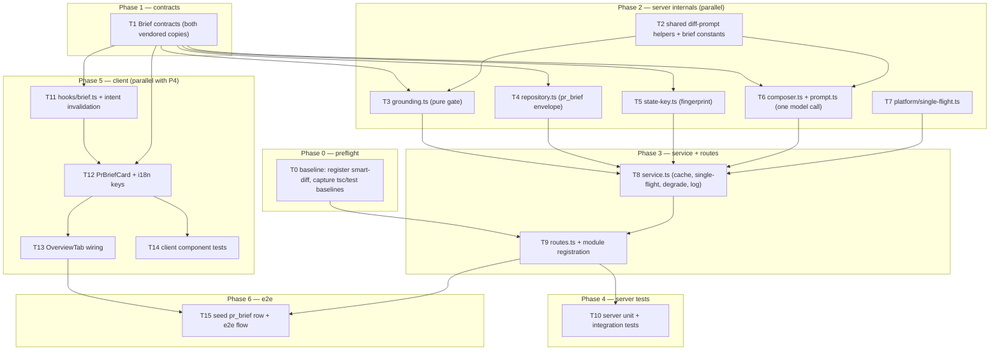

# Implementation Plan: PR Brief

Source spec: `specs/2026-08-14-pr-brief.md` (SPEC-2026-08-14-pr-brief, status: draft).
This plan does not author or edit that spec — it plans against it.

## Overview

Add a `brief` server module that composes a `Brief` (`what` / `why` / `risk_level` / `risks[]` /
`review_focus[]`) from signals DevDigest has already paid for — intent, blast radius, diff stats,
changed-file paths, `@@` hunk headers, linked issue, referenced specs — with exactly one structured
LLM call and no diff hunk bodies. Every citation is grounded against a citable-file / citable-endpoint
set computed from the diff, discard-don't-repair. The result is cached in the existing `pr_brief`
table behind a state key and rendered as a `PrBriefCard` at the top of the PR Overview tab, with
one-click deep links into the Files-changed tab.

The Intent Layer (`server/src/modules/intent/`) is the pattern being mirrored: service + classifier +
references + thin routes, model from a feature-model slot, header-only prompt, `wrapUntrusted`,
token-savings logging.

## Execution mode

**multi-agent (parallel)** — requested by the user ("owned paths (non-overlapping so tasks can run in
parallel)"). The plan is therefore phased with strictly non-overlapping `Owned paths` for any tasks
that can run concurrently, contracts defined first, and an explicit dependency DAG. Single-agent
execution also works: run T0 → T15 in listed order.

## Requirements (verified)

Restated from the spec and checked against the code. Every item cites the spec's own AC/G/N ids.

- **R1 — Input assembly is metadata-only.** Compose the model input from PR row + diff stats +
  changed-file paths + reconstructed `@@` headers + Intent + blast radius (facts + summary) + linked
  issue + resolved specs; never a diff hunk body line. Absent sections omit their heading.
  → AC-1, AC-2, AC-8, G1.
- **R2 — Reuse cached upstream signals.** Intent via the existing cached-or-compute path; blast via
  the existing per-PR read; references via the existing `parseReferences` / `resolveReferences`.
  → AC-3, AC-4, AC-6, US-6.
- **R3 — Degrade, never fail.** A degraded blast radius, a missing clone, an unresolvable issue or
  spec each remove a section and are recorded, not raised. Only a missing PR or a failed brief-model
  call errors. → AC-5, AC-6, G5.
- **R4 — Bounded reference content.** One named constant bounds resolved reference bytes; overflow is
  truncated with a visible marker. → AC-7.
- **R5 — Citable sets.** Citable files = the PR's changed-file paths. Citable endpoints = blast
  `impactedEndpoints` + affected crons. Both are carried into grounding. → AC-9.
- **R6 — Exactly one structured model call**, resolved from the `risk_brief` feature-model slot,
  constrained to a `Brief` schema with five required fields and per-entry field requirements, with
  `review_focus[]` ordered and capped by a named maximum. → AC-10..AC-14, G1.
- **R7 — Grounding is a pure gate.** Drop unreal file refs; drop refs-less risks; accept `path` and
  `path:line`; drop out-of-set focus rows; drop out-of-set endpoint/cron citations; downgrade
  `risk_level` to the highest surviving severity (lowest level when nothing survives). Same inputs →
  same output, no side effects. → AC-15..AC-20, G2, Non-functional/Determinism.
- **R8 — Cache with a state key.** Persist a versioned envelope in `pr_brief`; serve the stored brief
  with zero model calls when the key matches; recompose+overwrite on mismatch or explicit force;
  treat an unknown schema version as a miss; single-flight concurrent composition; never destroy a
  valid stored brief on a failed call. → AC-21..AC-27, AC-32, G3.
- **R9 — API surface.** `GET /pulls/:id/brief` (lazy compose-on-read) and `POST /pulls/:id/brief`
  (force flag), workspace-scoped, not-found across workspaces, rate-limited like the other
  one-LLM-call routes. → AC-28..AC-31.
- **R10 — `PrBriefCard` on the Overview tab**, above the Intent/Blast pair: risk level not by colour
  alone, `what`/`why` prose, risk rows with file refs, ordered "Review focus — read these first"
  list, keyboard-operable rows that deep-link into the Files-changed tab, Regenerate with pending
  state, loading/error/unavailable states, all copy from the `brief` namespace.
  → AC-33..AC-42, G4.
- **R11 — Observability.** Log present/absent input sections + resolved provider/model; log
  returned-vs-surviving counts for risks and focus entries; log header-only vs full-diff token
  estimates using the intent classifier's estimator. → AC-43..AC-45.
- **R12 — Untrusted handling.** Wrap PR title/body, issue content, and spec content before they reach
  the prompt; injected instructions must not survive grounding; no reads outside the clone and no
  outbound fetch when external fetching is disabled. → AC-46..AC-48.
- **R13 — Headline scenario** renders end to end on a seeded fixture PR (#482) with one composition
  and a working top-row deep link. → AC-49.

**Assumed defaults — confirm.** R8's state-key composition (Q1 below) and R9's GET rate limit (Q2
below) both rest on unconfirmed answers and are the only two items that change the plan's shape.

### Substrate verified before planning

| Spec claim | Verified |
|---|---|
| `pr_brief` table, `pr_id` PK + `json` jsonb | ✅ `server/src/db/schema/reviews.ts:57-62`, created in `migrations/0000_init.sql:211-214`. **Zero read/write call sites anywhere** — the brief module is its first consumer. No migration needed. |
| `risk_brief` feature-model slot | ✅ `server/src/vendor/shared/contracts/platform.ts:59-65` (`openai` / `gpt-4.1`). Declared but never resolved — `blast/service.ts:70` borrows `review_intent` instead. |
| `IntentCard.tsx` / `BlastRadiusCard.tsx` on Overview | ✅ `client/src/app/repos/[repoId]/pulls/[number]/_components/OverviewTab/OverviewTab.tsx:51,63` — a `1fr 1fr` grid. |
| Intent Layer as precedent | ✅ `server/src/modules/intent/{routes,service,classifier,references}.ts`. |
| `brief` i18n namespace already carries `unavailable`, `unavailableHint`, `noRisks` | ✅ `client/messages/en/brief.json`. Namespaces auto-load by filename (`client/src/i18n/request.ts:16-25`). |
| Existing open-file-at-line affordance | ✅ `onOpenFileLine` prop already threaded into `OverviewTab`; defined as `openFileLine` in `client/src/app/repos/[repoId]/pulls/[number]/page.tsx:88-89` (`setParams({tab:"diff", file, line})`). AC-37 needs no new plumbing. |

## Open questions & recommendations

### Questions that change the plan's shape

- **Q1 — What exactly goes in the state key? (AC-22 vs. the Non-functional latency promise.)**
  AC-22 says the key derives from head SHA **and** a fingerprint of the composed inputs "at minimum
  the intent record and the blast radius facts". But Non-functional says "a cache hit is a single row
  read". Those cannot both hold: validating a blast-facts fingerprint means calling
  `BlastService.getForPr` (a repo-intel index read + a prior-PRs query) on **every** cache-hit GET.
  Worse, `BlastRadiusResult.summary` is itself LLM output and `priorPrs` changes when unrelated PRs
  land — fingerprinting either makes the key non-deterministic and the cache would **never** hit,
  breaking AC-23.
  → **default: state key = `schema_version + head_sha + sha256(sorted changed-file paths) +
  sha256(intent record) + provider/model`.** Blast facts are fingerprinted and stored in the envelope
  for diagnosis (`blast_fingerprint`) but are **not** part of the validity key; a blast change is
  picked up by Regenerate or by the next head-SHA change. This satisfies AC-22's own stated
  observable (recomputing intent invalidates the brief), AC-23 (zero model calls), and the
  single-row-read latency promise. Confirm, or accept the extra blast read per Overview open.

- **Q2 — Rate limit on the composing GET (AC-30 vs AC-31).**
  AC-30 makes `GET /pulls/:id/brief` a composing route; AC-31 then rate-limits "the composing routes"
  at the one-LLM-call basis (`max: 10, timeWindow: '1 minute'` — `intent/routes.ts:36`,
  `reviews/routes.ts:29`). The limiter is per-client, not per-PR, so a reviewer browsing 11 PR
  Overviews in a minute would be 429'd on a **read**.
  → **default: `POST` gets `{ max: 10, timeWindow: '1 minute' }`; `GET` gets a looser
  `{ max: 30, timeWindow: '1 minute' }`** (still bounded, mirrors the `GET /pulls/:id/intent`
  precedent, which is deliberately unlimited). Confirm, or drop the GET limit entirely to match
  intent exactly. This is also spec Q6.

### Gaps, ambiguities and contradictions found in the spec

- **G-a — AC-13 contradicts "reuse `Risk` as-is".** The Contracts section says `risks[]` reuses the
  existing `Risk` schema unchanged, but `Risk.file_refs` is `z.array(z.string())` with **no `.min(1)`**
  (`contracts/brief.ts:50-57`), so AC-13's "the schema rejects a risk with an empty file-reference
  list" cannot hold.
  → **Rec:** add `BriefRisk = Risk.extend({ file_refs: z.array(z.string()).min(1), endpoint_refs:
  z.array(z.string()).default([]) })` in the same contracts file. Additive; `Risk` keeps its shape,
  so nothing existing breaks. Handled in **T1**.

- **G-b — Risks have nowhere to put an endpoint citation.** AC-19 grounds "a risk **or** focus entry
  [that] cites an endpoint or cron", but `Risk` has only `file_refs`. Covered by `endpoint_refs` in
  G-a's `BriefRisk`.

- **G-c — "affected crons" is not a field.** AC-4/AC-9 name "affected crons" as a blast output, but
  `BlastRadiusResult` has no cron array — crons live inside the **optional**
  `factsByFile: Record<string, { endpoints, crons }>` (`contracts/brief.ts:182-189`). The citable-cron
  set must be derived as `union(factsByFile[*].crons)` and must tolerate `factsByFile === undefined`.
  Recorded as a `Known gotcha` on **T5** and **T3**.

- **G-d — AC-41 has no wire representation.** The card must render an "unavailable" state when the PR
  has zero changed files, but the Contracts section says "only `brief` is returned to the client by
  default" and `Brief` has no unavailable/degraded field. The card cannot distinguish "no risks found"
  from "could not compose".
  → **Rec:** return `BriefResponse = { brief, degraded_inputs: string[], head_sha, generated_at,
  provider, model }` instead of a bare `Brief`. It also makes AC-43's diagnosis visible in the UI and
  costs nothing. Handled in **T1**; the card keys AC-41 off `degraded_inputs` containing
  `no_changed_files`.

- **G-e — AC-2's observable is untestable as literally written.** "no `+`/`-`/context source line from
  the diff appears anywhere in the assembled prompt" will false-positive: an untrusted PR body or a
  referenced spec can legitimately contain a line that also appears in the diff. The test must assert
  that the **changed-files section** of the prompt contains only `### <path>` and
  `@@ -a,b +c,d @@` lines, and that `diff.raw`'s body lines are absent from that section. Recorded on
  **T6** / **T10**.

- **G-f — AC-32 leaves the read behaviour undefined.** "the route shall return an error response and
  shall not overwrite a previously stored, still-valid brief" — but if the stored brief is *stale*
  (key mismatch) and recomposition fails, does GET 5xx or return the stale brief? The Edge case
  ("provider outage during regeneration → the previously stored brief … is still what a subsequent
  successful read returns") implies erroring is acceptable.
  → **default: error on both**, never overwrite. Optional improvement below.

- **G-g — AC-49 is not e2e-observable.** The e2e harness is deterministic with **no LLM**
  (`e2e/docs/flows.md`), so "one brief-model call" can only be asserted server-side.
  → Split: the one-call/grounding half is a server integration test (**T10**); the render + deep-link
  half is an e2e flow reading a **seeded** `pr_brief` row (**T15**), which also exercises AC-23's
  zero-model-call cache path.

- **G-h — `PrBrief` naming (spec Q1).** Left untouched as the spec assumes. Note its header comment
  (`contracts/brief.ts:130`, "Composed PR Brief (`pr_brief.json`)") becomes factually wrong once
  `pr_brief.json` holds a `BriefEnvelope`. **T1** updates that comment only — no shape change.

- **G-i — AC-41's reused copy doesn't fit.** `brief.unavailableHint` currently reads "Run a review or
  open the PR to compute it.", which is wrong advice for a zero-changed-files PR. **T12** adds a
  dedicated key in the same namespace rather than reusing that string verbatim.

### Blocking baseline defects found (not caused by this spec)

- **B-1 — `smart-diff` is not registered and `server/test/routes-smoke.test.ts` is RED on this branch.**
  `server/src/modules/smart-diff/routes.ts` exists and `client/src/lib/hooks/smart-diff.ts` calls it,
  but `smartDiff` is missing from `server/src/modules/index.ts:29-43`. Verified by running the suite:
  `test/routes-smoke.test.ts` → `1 failed | 5 passed`, on the assertion that every module is
  registered. Lost in the `8426e6d` merge (smart-diff came from `d002051` on another branch).
  This matters because **that same test is the acceptance gate for registering the brief module**.
  → **Rec:** fix it in **T0** (one import + one registry line). Out of the spec's scope but a
  one-line prerequisite; if the user declines, T9's acceptance must be baseline-diffed instead.

- **B-2 — `client` `tsc --noEmit` is not clean on main** (~16 pre-existing errors —
  `client/INSIGHTS.md`, 2026-08-08). Every client task's acceptance must **diff against a stashed
  baseline**, not read the error list absolutely.

- **B-3 — pre-existing shared-contract drift:** `FEATURE_MODELS.review_intent` is
  `openai/gpt-4.1` in `server/src/vendor/shared/contracts/platform.ts:52-58` but
  `openrouter/deepseek-v4-flash` in the client mirror `client/src/lib/utils/featureModels.ts:21-27`.
  The intent-layer plan's T2 was only half-applied. Not touched by this plan — flagged so it isn't
  mistaken for damage caused here. `risk_brief` itself is consistent across both, so this feature is
  unaffected.

### Other recommendations (user decides; not spec edits)

- **Rec-1 — Return the stale brief on a failed recomposition**, marked `stale: true`, instead of a
  bare error (softens G-f, and a slightly-old brief beats no brief during a provider outage). Deferred
  by default to keep AC-32 literal.
- **Rec-2 — Make the first-open cost visible.** AC-30 means opening a PR Overview silently fires an
  LLM call. Consider rendering a "Generate brief" affordance on first open rather than composing
  automatically. This contradicts AC-30 as written, so it is a spec decision, not a plan choice.
- **Rec-3 — Keep grounding in the server module, not `reviewer-core`.** It is pure and mirrors
  `groundFindings()`, so `reviewer-core` is tempting, but the spec's own cross-module diagram places
  it in the brief module and it needs no `LLMProvider`. Following the spec; noted so the choice is
  deliberate.
- **Rec-4 — Single-flight is in-process only.** No such helper exists anywhere in `server/src` (the
  nearest prior art is the boolean guard in `platform/price-book.ts:24,60`). AC-27 is therefore
  satisfied per process; it is not a distributed lock. Documented, not solved.
- **Rec-5 — Refresh the stale docs** in a follow-up: `server/docs/api-contracts.md` lists no
  intent/blast/smart-diff routes, `client/specs/pages.md` documents a `/pulls/:id` route that no
  longer exists, and `client/docs/ui-architecture.md` claims `@devdigest/shared` resolves to the
  server copy (it resolves to `client/src/vendor/shared/`). Out of scope here.

## Affected modules & contracts

- **server / new `modules/brief/`** — `routes.ts`, `service.ts`, `composer.ts`, `prompt.ts`,
  `grounding.ts`, `state-key.ts`, `repository.ts`, `constants.ts`, `index.ts`. Registered in
  `src/modules/index.ts`.
- **server / `modules/intent/`** — *consumed, not modified*, except one refactor: `estimateTokens` and
  `hunkHeader` (`classifier.ts:26-40`) are module-private and must be lifted to a shared helper so
  AC-45 uses "the same estimation method the intent classifier uses" rather than a copy. `references.ts`
  is already pure + injected and is reused unchanged.
- **server / `modules/blast/`** — consumed unchanged via `BlastService.getForPr(prId, workspaceId,
  { summary: true })`.
- **server / `modules/reviews/`** — consumed unchanged: `ReviewRepository.getPull/getRepo/getPrFiles`
  and `diff-loader.loadDiff`.
- **server / `modules/settings/`** — `resolveFeatureModel(container, ws, 'risk_brief')`. No registry
  change; the slot already exists.
- **server / `platform/`** — new `single-flight.ts`.
- **client** — new `PrBriefCard/` under the Overview tab, new `lib/hooks/brief.ts`, `OverviewTab.tsx`
  wiring, new keys in `messages/en/brief.json`.
- **e2e** — one new flow + a seeded `pr_brief` row.
- **reviewer-core** — **no changes.** `wrapUntrusted` is consumed through the existing shim
  `server/src/platform/prompt.ts:8`.
- **Database** — **no migration.** `pr_brief` already exists and is already migrated.

### Contracts

**ADDITIVE to an existing shared contract — explicit callout.** `contracts/brief.ts` gains
`BriefRiskLevel`, `ReviewFocusItem`, `BriefRisk`, `Brief`, `BriefEnvelope`, `BriefResponse`. No
existing schema changes shape; `PrBrief`, `Risk` and `RiskSeverity` are left as they are (only
`PrBrief`'s stale header comment is corrected, per G-h).

Two hard constraints on that edit:
1. `server/src/vendor/shared/` is a **do-not-touch-without-coordination** path (`CLAUDE.md`). This is
   the coordination: additive only, one file, one task.
2. The contract is **vendored twice** — `server/src/vendor/shared/contracts/brief.ts` and
   `client/src/vendor/shared/contracts/brief.ts` — and there is no sync script. They are currently
   byte-identical (verified with `diff`) and `brief.ts` has no relative imports, so the `.js`-extension
   divergence trap (`client/INSIGHTS.md`, 2026-08-07) does **not** apply to this file — but both copies
   must still be edited in lock-step in the same task. The barrel
   (`vendor/shared/index.ts:19`) already re-exports `./contracts/brief.js`; no barrel edit needed.

## Architecture changes

Onion placement for every new file:

| File | Layer | Rule it must respect |
|---|---|---|
| `server/src/modules/brief/routes.ts` | Transport | Zod params/body/response via `fastify-type-provider-zod`; `getContext` → one service call → reply. No logic, no DB, no SDK. |
| `server/src/modules/brief/service.ts` | Application | Orchestrates via `container.*` and `ReviewRepository` / `BlastService` / `IntentService`. No SQL, no SDK. |
| `server/src/modules/brief/composer.ts`, `prompt.ts` | Application (pure helper, mirrors `intent/classifier.ts`) | Receives resolved inputs + injected `LLMProvider`. No DB, no GitHub, no fetching. |
| `server/src/modules/brief/grounding.ts` | Application (pure) | Pure function, no I/O, no side effects (Non-functional/Determinism). |
| `server/src/modules/brief/state-key.ts` | Application (pure) | Pure hashing only. |
| `server/src/modules/brief/repository.ts` | Infrastructure | The **only** brief file allowed to import `db/schema` + `drizzle-orm`. |
| `server/src/modules/_shared/diff-prompt.ts` | Application helper | Pure; shared by `intent` and `brief`. |
| `server/src/platform/single-flight.ts` | Platform | Pure in-process promise coalescing. |
| `client/.../PrBriefCard/*` | Client component | `"use client"` (interactivity + hooks); server state via TanStack Query only. |
| `client/src/lib/hooks/brief.ts` | Client data layer | All API access through `src/lib/api.ts`; query keys live with the hook, mirroring `hooks/intent.ts`. |

Cross-module reads go through the module's own public service (`BlastService`, `IntentService`) and
`ReviewRepository` — the same shape `IntentService` already uses. `BriefService` is **not** registered
in the container: per `platform/container.ts`, only cross-cutting repositories and adapters are;
feature services are `new`-ed in `routes.ts` (per-request when they need `req.log`, as intent does).

**Concurrency groups (multi-agent):** `{T0, T1, T2, T7}` → `{T3, T4, T5, T6}` → `{T8}` → `{T9}` →
`{T10, T11}` → `{T12}` → `{T13, T14}` → `{T15}`. No two tasks in the same group share an owned path.

## Phased tasks

### Phase 0 — Preflight

- **T0**
  - **Action:** (1) Register the orphaned smart-diff module: add `import smartDiff from
    "./smart-diff/routes.js";` and a `smartDiff,` entry to the registry object in
    `server/src/modules/index.ts`. (2) Capture and record two baselines for later tasks to diff
    against: `cd server && npm test 2>&1 | tail -40 > /tmp/server-baseline.txt` and
    `cd client && npx tsc --noEmit 2>&1 > /tmp/client-tsc-baseline.txt`. Do not fix anything else.
  - **Module:** server
  - **Type:** backend
  - **Skills to use:** fastify-best-practices, onion-architecture
  - **Owned paths:** `server/src/modules/index.ts`
  - **Depends-on:** none
  - **Risk:** low
  - **Known gotchas:** Static registration only — there is no filesystem autoload (`CLAUDE.md`;
    `modules/index.ts:20-23` explains why). Registering a module is exactly one import + one entry.
    The client hook `client/src/lib/hooks/smart-diff.ts` has been calling a 404 route.
  - **Acceptance:** `cd server && npx vitest run test/routes-smoke.test.ts` → **6 passed, 0 failed**
    (currently `1 failed | 5 passed`); `app.printRoutes()` contains `/smart-diff`.
    `/tmp/client-tsc-baseline.txt` exists and is non-empty.

### Phase 1 — Contracts

- **T1**
  - **Action:** Add to **both** `server/src/vendor/shared/contracts/brief.ts` and
    `client/src/vendor/shared/contracts/brief.ts` (identical content, same task, same commit):
    - `BriefRiskLevel = RiskSeverity` (re-export the same ordered domain, per the spec's Contracts
      section) plus an exported ordered array `BRIEF_RISK_LEVEL_ORDER = ['low','medium','high'] as const`
      so AC-20's comparison is over one domain.
    - `ReviewFocusItem = z.object({ file: z.string().min(1), line: z.number().int().positive().nullable(),
      reason: z.string().min(1), endpoint_ref: z.string().nullish() })`.
    - `BriefRisk = Risk.extend({ file_refs: z.array(z.string()).min(1), endpoint_refs:
      z.array(z.string()).default([]) })` (per G-a/G-b — `Risk` itself is **not** modified).
    - `Brief = z.object({ what: z.string(), why: z.string(), risk_level: BriefRiskLevel,
      risks: z.array(BriefRisk), review_focus: z.array(ReviewFocusItem) })` — all five required.
    - `BriefEnvelope = z.object({ schema_version: z.number().int(), state_key: z.string(),
      head_sha: z.string().nullable(), generated_at: z.string(), provider: z.string(),
      model: z.string(), degraded_inputs: z.array(z.string()), blast_fingerprint: z.string().nullable(),
      brief: Brief })`.
    - `BriefResponse = z.object({ brief: Brief, degraded_inputs: z.array(z.string()),
      head_sha: z.string().nullable(), generated_at: z.string(), provider: z.string(),
      model: z.string() })` (per G-d).
    - Export a pure `parseFileRef(ref: string): { file: string; line: number | null }` splitting a
      trailing `:<digits>` — one definition consumed by the server's grounding and the client's risk
      rows so they cannot drift.
    - Correct only the stale header comment above `PrBrief` (`brief.ts:130`) to say it is a Part-0
      placeholder superseded by `BriefEnvelope` for `pr_brief.json`. No shape change.
    Then add schema tests to `server/test/contracts.test.ts` covering AC-12 (rejects an object missing
    any of the five fields), AC-13 (rejects `file_refs: []`; rejects a focus item with no `reason`),
    and `parseFileRef` on `src/config.ts:12` / `src/config.ts` (AC-17).
  - **Module:** server (+ client mirror)
  - **Type:** backend
  - **Skills to use:** zod (`type-export-schemas-and-types`, `object-extend-for-composition`,
    `schema-use-enums`), typescript-expert, onion-architecture
  - **Owned paths:** `server/src/vendor/shared/contracts/brief.ts`,
    `client/src/vendor/shared/contracts/brief.ts`, `server/test/contracts.test.ts`
  - **Depends-on:** none
  - **Risk:** medium
  - **Known gotchas:** `server/src/vendor/shared/` is a do-not-touch path — this task is the sanctioned,
    additive-only exception; do not change any existing schema's shape. The two copies are vendored
    duplicates with **no sync script**; edit both or the client build/typecheck diverges
    (`server/INSIGHTS.md` 2026-06-14, `client/INSIGHTS.md` 2026-08-07). `brief.ts` imports only `zod`,
    so the `.js`-extension divergence does not apply here — keep both files byte-identical. The barrel
    already `export *`s this file; do not edit `vendor/shared/index.ts`. Adding a required field to a
    contract has previously broken the inline fixtures in `contracts.test.ts`
    (`server/INSIGHTS.md` 2026-06-14) — we only add new schemas, so existing fixtures must stay green.
  - **Acceptance:** `diff server/src/vendor/shared/contracts/brief.ts
    client/src/vendor/shared/contracts/brief.ts` → empty. `cd server && npm run typecheck` and
    `cd client && npx tsc --noEmit` show **no new errors vs. `/tmp/client-tsc-baseline.txt`**.
    `cd server && npx vitest run test/contracts.test.ts` passes, including the new AC-12/AC-13/AC-17
    cases.

### Phase 2 — Server internals (T2, T3, T4, T5, T6, T7 — T2/T7 first, then T3–T6 in parallel)

- **T2**
  - **Action:** Create `server/src/modules/_shared/diff-prompt.ts` exporting the two helpers currently
    private to the intent classifier, moved verbatim: `estimateTokens(s: string): number`
    (`Math.ceil(s.length / 4)`) and `hunkHeader(hunk): string`
    (`` `@@ -${oldStart},${oldLines} +${newStart},${newLines} @@` ``), plus
    `changedFilesSection(diff: UnifiedDiff): string` rendering `### <path>` + one header line per hunk
    and nothing else. Update `server/src/modules/intent/classifier.ts` to import them and delete its
    local copies — behaviour must be byte-identical. Also create
    `server/src/modules/brief/constants.ts` with `BRIEF_SCHEMA_VERSION = 1`,
    `MAX_REVIEW_FOCUS = 6`, `REFERENCE_BUDGET_BYTES = 12_000` (matching
    `intent/references.ts:53`'s `DEFAULT_BUDGET_BYTES`), and `TRUNCATION_MARKER = '\n…[truncated]'`.
  - **Module:** server
  - **Type:** backend
  - **Skills to use:** onion-architecture, typescript-expert
  - **Owned paths:** `server/src/modules/_shared/diff-prompt.ts`,
    `server/src/modules/intent/classifier.ts`, `server/src/modules/brief/constants.ts`
  - **Depends-on:** none
  - **Risk:** medium (touches a working module)
  - **Known gotchas:** ESM — relative imports carry the `.js` extension (`CLAUDE.md`). The estimator is
    deliberately coarse and always logged with a `~` prefix; AC-45 requires *the same* method, so do
    not "improve" it. `UnifiedDiff` hunks carry **no** header string — only `oldStart/oldLines/
    newStart/newLines` (`vendor/shared/adapters.ts:175-188`), which is exactly why `hunkHeader`
    reconstructs one. Do not change the intent prompt's byte output.
  - **Acceptance:** `cd server && npm run typecheck` passes; `cd server && npm test` shows **no new
    failures vs. `/tmp/server-baseline.txt`**; a unit assertion that
    `hunkHeader({oldStart:1,oldLines:4,newStart:1,newLines:7}) === '@@ -1,4 +1,7 @@'` and that
    `changedFilesSection` output contains no `+`/`-`-prefixed source line.

- **T7**
  - **Action:** Create `server/src/platform/single-flight.ts`: `export function createSingleFlight
    <T>(): (key: string, fn: () => Promise<T>) => Promise<T>` backed by a `Map<string, Promise<T>>`
    that stores the in-flight promise, returns the existing one on a duplicate key, and deletes the
    entry in a `finally` so a rejection does not poison the key. Document that it is per-process.
  - **Module:** server
  - **Type:** backend
  - **Skills to use:** typescript-expert, onion-architecture
  - **Owned paths:** `server/src/platform/single-flight.ts`
  - **Depends-on:** none
  - **Risk:** low
  - **Known gotchas:** No such helper exists in the codebase; the nearest prior art
    (`platform/price-book.ts:24,60`) is a fire-and-forget boolean guard that lets concurrent callers
    see stale data — that shape does **not** satisfy AC-27, which requires the second caller to *await
    the first's result*. Must delete the map entry on rejection, or a single provider outage
    permanently caches a rejected promise for that PR.
  - **Acceptance:** `cd server && npm run typecheck` passes; a unit test where 2 concurrent calls with
    the same key invoke the underlying fn **exactly once** and both resolve to the same value, and
    where a rejected call is not cached (the next call re-invokes). (Test file owned by T10.)

- **T3**
  - **Action:** Create `server/src/modules/brief/grounding.ts` exporting one pure function
    `groundBrief(raw: Brief, sets: { files: ReadonlySet<string>; endpoints: ReadonlySet<string> }):
    { brief: Brief; stats: { risksIn: number; risksOut: number; focusIn: number; focusOut: number } }`.
    Algorithm, in order: (1) for each risk, keep only `file_refs` whose `parseFileRef(ref).file` is in
    `sets.files`, preserving the line (AC-15, AC-17); (2) keep only `endpoint_refs` present in
    `sets.endpoints` (AC-19); (3) drop any risk left with zero `file_refs` (AC-16); (4) drop any
    `review_focus` entry whose `file` is not in `sets.files` (AC-18) and whose `endpoint_ref`, when
    present, is not in `sets.endpoints` (AC-19); (5) dedupe focus entries by `` `${file}:${line ?? ''}` ``,
    first occurrence wins (Edge case); (6) truncate `review_focus` to `MAX_REVIEW_FOCUS` preserving the
    model's order, dropping — never merging — the remainder (AC-14); (7) set `risk_level` to the highest
    surviving severity if that is lower than the model's value, and to `'low'` with `risks: []` when
    nothing survives (AC-20). No I/O, no logging, no `Date`, no randomness.
  - **Module:** server
  - **Type:** backend
  - **Skills to use:** typescript-expert, zod, onion-architecture, security (discard-don't-repair)
  - **Owned paths:** `server/src/modules/brief/grounding.ts`
  - **Depends-on:** T1, T2
  - **Risk:** medium
  - **Known gotchas:** Discard, never repair — mirrors `reviewer-core/specs/grounding-spec.md` and its
    score recomputation. A directory-style citation (`src/api/`) must fail the exact-path match and be
    dropped (Edge case). Line numbers are **not** validated against file length in v1 (spec Q3). The
    function must not mutate its input (Determinism). Do not import anything from `db/` or `adapters/`.
  - **Acceptance:** `cd server && npm run typecheck` passes. Behaviour is proven by T10's suite:
    hallucinated path dropped; `src/config.ts:12` survives with line 12 and `src/config.ts` with null;
    a risk whose only ref was hallucinated disappears; an invented `GET /api/admin` is removed while a
    real impacted endpoint survives; 12 focus items → exactly 6 in model order; a `high` from the model
    with only `low` survivors → `low`; all-hallucinated → `{ risk_level: 'low', risks: [] }`;
    `groundBrief(x)` called twice returns deep-equal results and leaves `x` unchanged.

- **T4**
  - **Action:** Create `server/src/modules/brief/repository.ts`: `export class BriefRepository {
    constructor(private db: Db) {} }` with `getEnvelope(prId: string): Promise<BriefEnvelope |
    undefined>` — selects `t.prBrief.json`, runs `BriefEnvelope.safeParse`, and returns `undefined`
    when the parse fails **or** `schema_version !== BRIEF_SCHEMA_VERSION` (AC-26: a cache miss, never a
    deserialisation error) — and `upsertEnvelope(prId: string, env: BriefEnvelope): Promise<void>` using
    `.onConflictDoUpdate({ target: t.prBrief.prId, set: { json: env } })`.
  - **Module:** server
  - **Type:** backend
  - **Skills to use:** drizzle-orm-patterns, postgresql-table-design, zod (`parse-use-safeparse`),
    onion-architecture
  - **Owned paths:** `server/src/modules/brief/repository.ts`
  - **Depends-on:** T1
  - **Risk:** low
  - **Known gotchas:** **No migration.** `pr_brief` already exists (`db/schema/reviews.ts:57-62`,
    `migrations/0000_init.sql:211-214`) and `server/src/db/migrations/` is a do-not-touch path. This is
    the only brief file allowed to import `db/schema` + `drizzle-orm` (onion). `pr_brief.json` is an
    untyped `jsonb`, so unlike `pr_intent` there is **no** typed-column safety net — `safeParse` on read
    is mandatory. The table has no `workspace_id`; tenancy is enforced upstream by the workspace-scoped
    `ReviewRepository.getPull(workspaceId, prId)`, exactly as `pr_intent` does. Follow
    `reviews/repository/pull.repo.ts:49-62` (`upsertIntent`) for the upsert shape.
  - **Acceptance:** `cd server && npm run typecheck` passes; T10's integration test writes an envelope
    with `schema_version: 0`, then `getEnvelope` returns `undefined` with **no thrown error**, and a
    round-trip of a current-version envelope returns a deep-equal object.

- **T5**
  - **Action:** Create `server/src/modules/brief/state-key.ts` with two pure exports:
    `fingerprintBlast(blast: BlastRadiusResult): string` — a stable sha256 over **only** the
    deterministic facts (`changedSymbols`, `callers`, `impactedEndpoints`, `factsByFile`, `degraded`,
    `reason`), with keys sorted and **`summary` and `priorPrs` excluded** — and
    `deriveStateKey(input: { headSha: string | null; changedPaths: string[]; intent: Intent | null;
    provider: string; model: string }): string` — sha256 over
    `BRIEF_SCHEMA_VERSION | headSha | sorted(changedPaths) | canonical(intent) | provider | model`
    (per Q1's default). Also export `citableSets(changedPaths: string[], blast: BlastRadiusResult |
    null): { files: Set<string>; endpoints: Set<string> }` implementing AC-9: files from the changed
    paths, endpoints from `blast.impactedEndpoints` **plus** the union of
    `Object.values(blast.factsByFile ?? {}).flatMap(f => f.crons)`.
  - **Module:** server
  - **Type:** backend
  - **Skills to use:** typescript-expert, onion-architecture
  - **Owned paths:** `server/src/modules/brief/state-key.ts`
  - **Depends-on:** T1, T2
  - **Risk:** medium
  - **Known gotchas:** **`summary` is LLM output and `priorPrs` changes when unrelated PRs land** — if
    either enters a fingerprint used as the validity key, the key changes on every compose and AC-23's
    cache hit never happens. See Q1. `factsByFile` is **optional** on `BlastRadiusResult`
    (`contracts/brief.ts:182-189`) and is the **only** place crons exist — there is no
    `affectedCrons` field despite AC-4's wording (G-c). Hashing must be order-stable: sort arrays and
    object keys before serialising, or two identical inputs produce two keys.
  - **Acceptance:** `cd server && npm run typecheck` passes; T10 asserts `deriveStateKey` is stable
    across two calls on the same input, changes when the intent record changes (AC-22's stated
    observable) and when `headSha` changes (AC-24), and does **not** change when only
    `blast.summary` / `blast.priorPrs` differ; `citableSets` yields crons from `factsByFile` and an
    empty endpoint set when `factsByFile` is `undefined`.

- **T6**
  - **Action:** Create `server/src/modules/brief/prompt.ts` and `server/src/modules/brief/composer.ts`.
    `prompt.ts` exports `SYSTEM_PROMPT` (data-only / untrusted framing modelled on
    `intent/classifier.ts:107-127`, plus: cite only files present in the changed-file list, cite only
    listed endpoints, order `review_focus` most-important-first, one-line reasons) and
    `buildUserMessage(opts): { message: string; sections: { present: string[]; absent: string[] } }`
    emitting, in order and **omitting the heading entirely when absent** (AC-8): `## PR` (title,
    author, branch → base — wrapped), `## Diff stats` (additions, deletions, changed-file count),
    `## Changed files` (via `changedFilesSection` from T2 — paths + `@@` headers only, **never** a body
    line, AC-2), `## Intent`, `## Blast radius` (summary sentence + changed symbols + caller rows +
    impacted endpoints + crons, or an explicit "unavailable: <reason>" line when degraded, AC-5),
    `## Linked issue` (wrapped), `## Referenced plans/specs` (wrapped, bounded by
    `REFERENCE_BUDGET_BYTES` with `TRUNCATION_MARKER`, AC-7). `composer.ts` exports
    `composeBrief(opts: { ...resolved inputs; llm: LLMProvider; model: string; provider: string;
    logger?: Logger }): Promise<{ raw: Brief; sections; tokens: { headerOnly: number; fullDiff: number;
    saved: number } }>` making **exactly one** `llm.completeStructured({ model, schema: Brief,
    schemaName: 'Brief', messages: [system, user], temperature: 0.1 })` call (AC-10) and emitting the
    AC-43 (sections present/absent + provider/model) and AC-45 (both token estimates) log lines.
    No DB, no GitHub, no fetching — resolved inputs only.
  - **Module:** server
  - **Type:** backend
  - **Skills to use:** zod (`schema-use-enums`, `parse-use-safeparse`), security (prompt injection /
    untrusted wrapping), onion-architecture, typescript-expert
  - **Owned paths:** `server/src/modules/brief/prompt.ts`, `server/src/modules/brief/composer.ts`
  - **Depends-on:** T1, T2
  - **Risk:** high
  - **Known gotchas:** Import `wrapUntrusted` from `../../platform/prompt.js` (the shim), **never** from
    `@devdigest/reviewer-core` directly. `wrapUntrusted` supplies delimiters but **not** the
    `INJECTION_GUARD` — that is only appended by `assemblePrompt`, which this path does not use, so the
    guard language must live in `SYSTEM_PROMPT` (this is exactly what `BlastService` gets wrong: its
    user message at `blast/service.ts:83` is unwrapped — do not copy it). AC-2's observable is
    unwritable as literally stated (G-e): assert on the `## Changed files` section, not the whole
    prompt. `estimateTokens`/`hunkHeader` must come from T2's `_shared/diff-prompt.ts` so AC-45 uses
    the same method the intent classifier uses. `StructuredResult` carries `tokensIn/tokensOut/costUsd`
    (`adapters.ts:73-81`) — intent throws them away; log them here since AC-45 is a cost claim.
  - **Acceptance:** `cd server && npm run typecheck` passes; T10 asserts: a fixture PR with every input
    present yields a prompt containing all eight headings and no others (AC-1); the `## Changed files`
    section contains only `### <path>` and `@@ …@@` lines and none of `diff.raw`'s `+`/`-`/context
    lines (AC-2); a PR with no body and no references produces a prompt with no `## PR Description`
    and no `## Referenced plans/specs` heading (AC-8); a 200 KB referenced spec yields an input at or
    under `REFERENCE_BUDGET_BYTES` containing `TRUNCATION_MARKER` (AC-7); every untrusted section is
    enclosed in `<untrusted source="…">` (AC-46); a `MockLLMProvider` records **exactly one**
    `completeStructured` call (AC-10); the log line names present/absent sections plus provider/model
    (AC-43) and both token estimates (AC-45).

### Phase 3 — Service & routes

- **T8**
  - **Action:** Create `server/src/modules/brief/service.ts`: `export class BriefService {
    constructor(private container: Container, logger?: Logger) }` mirroring `IntentService`
    (`intent/service.ts:27-40`), with `getOrCompose(workspaceId, prId): Promise<BriefResponse>` and
    `compose(workspaceId, prId, opts: { force?: boolean }): Promise<BriefResponse>`. Orchestration:
    (1) `ReviewRepository.getPull(workspaceId, prId)` → `NotFoundError` when absent (AC-31);
    (2) `getRepo`; (3) `getPrFiles` for changed paths + diff stats — **when the path list is empty,
    short-circuit: persist nothing, make no model call, and return a `BriefResponse` with an empty
    `Brief` (`risk_level: 'low'`) and `degraded_inputs: ['no_changed_files']`** (AC-41, Edge case);
    (4) `loadDiff` for hunk headers; (5) `IntentService.getOrCompute` in a try/catch — failure adds
    `intent_unavailable` to `degraded_inputs` and omits the section (AC-3, AC-6); (6)
    `BlastService.getForPr(prId, workspaceId, { summary: true })` in a try/catch — a `degraded: true`
    result or a throw adds `blast_degraded:<reason>` and composes from the rest (AC-4, AC-5);
    (7) `parseReferences` + `resolveReferences` with `container.git` / `container.github().catch(() =>
    null)` / `container.config.externalFetchEnabled ? container.webFetch : null`, every failure
    best-effort (AC-6, AC-48); (8) `resolveFeatureModel(container, workspaceId, 'risk_brief')` +
    `container.llm(provider)` (AC-11); (9) `deriveStateKey` and, unless `force`, compare against
    `BriefRepository.getEnvelope` — on a match return the stored brief with **zero** model calls
    (AC-23); (10) wrap the whole compose-and-persist step in the T7 single-flight keyed on `prId`
    (AC-27); (11) `composeBrief` → `groundBrief` with `citableSets` → log returned-vs-surviving counts
    (AC-44) → `upsertEnvelope` **only after** a successful call, so a provider error leaves the stored
    brief intact (AC-32) → return `BriefResponse`.
  - **Module:** server
  - **Type:** backend
  - **Skills to use:** onion-architecture, fastify-best-practices, zod, security, typescript-expert
  - **Owned paths:** `server/src/modules/brief/service.ts`
  - **Depends-on:** T3, T4, T5, T6, T7
  - **Risk:** high
  - **Known gotchas:** Reach other modules through their public service (`BlastService`,
    `IntentService`) or `ReviewRepository` — never another module's internal files (onion rule 6).
    `BlastService.getForPr` with `{ summary: true }` costs one LLM call; call it **only** on the
    compose path, never during cache validation, or AC-23 breaks. `container.github()` throws
    `ConfigError` without a PAT — `.catch(() => null)` as intent does. Best-effort enrichment must
    never throw (`server/AGENTS.md`: "context enrichment is best-effort — omit the section, don't
    throw"). `resolveFeatureModel` does a full settings-table read per call — resolve the slot once.
    The single-flight is per-process only (Rec-4).
  - **Acceptance:** `cd server && npm run typecheck` passes. T10 asserts: a PR with a stored intent
    issues **zero** intent-model calls (AC-3); an unindexed repo (mock `RepoIntel` returning
    `degraded: true`) still returns a complete `Brief` with `degraded_inputs` naming blast (AC-5); a
    body linking a nonexistent issue still composes (AC-6); a second request on an unchanged PR issues
    **zero** model calls (AC-23); recomputing intent then requesting the brief recomposes (AC-22);
    `force: true` on an unchanged PR issues **exactly one** call (AC-25); two concurrent requests
    produce **one** call and two identical responses (AC-27); a forced provider error leaves the prior
    stored envelope byte-identical and still readable (AC-32); a zero-changed-file PR makes **no**
    model call (AC-41).

- **T9**
  - **Action:** Create `server/src/modules/brief/routes.ts` (thin Fastify plugin, `ZodTypeProvider`,
    `getContext` → one service call → reply) and `server/src/modules/brief/index.ts`
    (`export { default } from "./routes.js";`, matching `blast/index.ts`):
    - `GET /pulls/:id/brief` — `{ schema: { params: IdParams, response: { 200: BriefResponse } } }`,
      `config: { rateLimit: { max: 30, timeWindow: '1 minute' } }` (Q2 default), handler
      `service.getOrCompose(workspaceId, id)` (AC-30).
    - `POST /pulls/:id/brief` — `{ schema: { params: IdParams, body: z.object({ force:
      z.boolean().default(false) }).default({}), response: { 200: BriefResponse } } }`,
      `config: { rateLimit: { max: 10, timeWindow: '1 minute' } }`, handler
      `service.compose(workspaceId, id, { force })` (AC-28, AC-29).
    Construct `new BriefService(app.container, req.log)` **per request** (it needs `req.log` for
    AC-43..AC-45), as `intent/routes.ts:25,40` does. Then register the module: one import + one entry
    in `server/src/modules/index.ts`, and add `'/brief'` to the registry-guard array in
    `server/test/routes-smoke.test.ts:65`.
  - **Module:** server
  - **Type:** backend
  - **Skills to use:** fastify-best-practices (routes, schemas, serialization), zod, onion-architecture,
    security (workspace scoping)
  - **Owned paths:** `server/src/modules/brief/routes.ts`, `server/src/modules/brief/index.ts`,
    `server/src/modules/index.ts`, `server/test/routes-smoke.test.ts`
  - **Depends-on:** T0, T8
  - **Risk:** medium
  - **Known gotchas:** Shares `server/src/modules/index.ts` and `routes-smoke.test.ts` with T0 — this is
    why T9 `Depends-on: T0` rather than running beside it; the two must never be concurrent. Declare a
    **response** schema: a params-only route makes the Zod contract compile-time-only, and a
    `.default([])` on a response field then never executes at runtime
    (`server/INSIGHTS.md` 2026-08-08). Static segments must be registered before UUID params or Fastify
    matches the literal as the param (`server/INSIGHTS.md` 2026-06-18) — `/brief` is a suffix here, so
    no conflict, but keep the ordering discipline. Rate limiting is disabled under `NODE_ENV=test`
    (`app.ts:93-97`), so the AC-31 limit assertion needs a non-test config or must be asserted on the
    route's declared `config` object.
  - **Acceptance:** `cd server && npx vitest run test/routes-smoke.test.ts` passes with `/brief` added
    to the guard array; `app.printRoutes()` contains `/pulls/:id/brief` for both GET and POST;
    `GET /pulls/not-a-uuid/brief` → `422` with `error.code === 'validation_error'` (proves the route is
    registered and its schema runs); a PR id from another workspace → `404` (AC-31).

### Phase 4 — Server tests (parallel with Phase 5)

- **T10**
  - **Action:** Write the server suite covering every acceptance listed on T3–T9. Files:
    `server/test/brief-grounding.test.ts` (pure, AC-14..AC-20 + determinism + the injection fixture
    AC-47), `server/test/brief-state-key.test.ts` (AC-9, AC-22, AC-24), `server/test/brief-composer.test.ts`
    (AC-1, AC-2, AC-7, AC-8, AC-10, AC-43, AC-45, AC-46), `server/test/brief-single-flight.test.ts`
    (T7's contract), and `server/test/brief-service.it.test.ts` (AC-3, AC-5, AC-6, AC-21, AC-23,
    AC-25..AC-27, AC-32, AC-41, AC-49's one-call half). Inject via
    `buildApp({ config, overrides: { llm: { openai: new MockLLMProvider(...) }, repoIntel: …, github: …,
    git: … } })` — no monkey-patching, no module mocks.
  - **Module:** server
  - **Type:** backend
  - **Skills to use:** fastify-best-practices (testing with `inject()`), zod, security, typescript-expert
  - **Owned paths:** `server/test/brief-grounding.test.ts`, `server/test/brief-state-key.test.ts`,
    `server/test/brief-composer.test.ts`, `server/test/brief-single-flight.test.ts`,
    `server/test/brief-service.it.test.ts`
  - **Depends-on:** T9
  - **Risk:** medium
  - **Known gotchas:** `*.it.test.ts` is the DB-backed convention and uses `server/test/helpers/pg.ts`
    (testcontainers) — it needs Docker; the pure suites must not. AC-47's fixture: a PR body instructing
    the model to cite `/etc/passwd` must still yield a schema-valid `Brief` with that citation removed
    by grounding, **not** by prompt wording. Model-call counting must be done on the injected
    `MockLLMProvider`, which is the only place "exactly one call" is observable. Rate limiting is off
    under `NODE_ENV=test`.
  - **Acceptance:** `cd server && npm test` — all five new files green, and **no new failures vs.
    `/tmp/server-baseline.txt`**. Every AC listed in the Action line has at least one named test whose
    title cites its AC id.

### Phase 5 — Client (parallel with Phase 4)

- **T11**
  - **Action:** Create `client/src/lib/hooks/brief.ts` mirroring `hooks/intent.ts`:
    `useBrief(prId)` → `useQuery<BriefResponse>({ queryKey: ["brief", prId], queryFn: () =>
    api.get<BriefResponse>(\`/pulls/${prId}/brief\`), enabled: prId != null, retry: (n, e) =>
    (e as {status?:number})?.status === 404 ? false : n < 2 })`, and
    `useRegenerateBrief(prId)` → `useMutation({ mutationFn: () => api.post<BriefResponse>(
    \`/pulls/${prId}/brief\`, { force: true }), onSuccess: (d) => qc.setQueryData(["brief", prId], d) })`.
    Export from `client/src/lib/hooks/index.ts`. Also add to `client/src/lib/hooks/intent.ts`'s
    `useRecomputeIntent` `onSuccess`: `qc.invalidateQueries({ queryKey: ["brief", prId] })` — the spec's
    Edge case ("the client **should** invalidate its brief query when intent recompute succeeds").
  - **Module:** client
  - **Type:** ui
  - **Skills to use:** react-best-practices (data fetching in hooks), frontend-architecture, next-best-practices
  - **Owned paths:** `client/src/lib/hooks/brief.ts`, `client/src/lib/hooks/index.ts`,
    `client/src/lib/hooks/intent.ts`
  - **Depends-on:** T1
  - **Risk:** low
  - **Known gotchas:** All API access goes through `src/lib/api.ts` (`client/AGENTS.md`); `api.ts`
    holds only the generic `get/post/put/patch/del` client — per-feature calls live in the hook file,
    as `hooks/intent.ts` does. `api.get<T>` is a **bare cast, not a Zod parse**, so a
    `.default([])` on a response field never runs client-side and a stale React-Query cache entry can
    deliver `undefined` — read defensively (`res.degraded_inputs ?? []`)
    (`server/INSIGHTS.md` 2026-08-08). Types come from `@devdigest/shared`; never hand-duplicate.
  - **Acceptance:** `cd client && npx tsc --noEmit` shows **no new errors vs.
    `/tmp/client-tsc-baseline.txt`**; `["brief", prId]` is the only query key used; recomputing intent
    invalidates it (asserted in T14).

- **T12**
  - **Action:** Create `client/src/app/repos/[repoId]/pulls/[number]/_components/OverviewTab/PrBriefCard/`
    with `PrBriefCard.tsx` (`"use client"`), `RiskLevelBadge.tsx`, `ReviewFocusList.tsx`,
    `constants.ts`, `index.ts`. The card renders its **own** `SectionLabel` inside the `Card` (matching
    `IntentCard`), a `RiskLevelBadge` whose accessible name and visible text both carry the level word
    (AC-34), `what` / `why` as prose (AC-35), `risks[]` as rows showing title + each file ref via
    `parseFileRef` (AC-35), an ordered `review_focus[]` list under a "Review focus — read these first"
    heading (AC-36), a Regenerate control wired to `useRegenerateBrief` that is `disabled` while
    `isPending` (AC-39), distinct loading / error-with-retry / loaded states (AC-40), and the
    unavailable state when `degraded_inputs` contains `no_changed_files` (AC-41). Focus rows and risk
    file refs are `<button>`s calling an `onOpenFileLine(file, line)` prop, keyboard-operable with the
    file path in the accessible name (AC-37, AC-38). Add every string as a key under
    `client/messages/en/brief.json` (new keys: `card.*`, `reviewFocus.*`, `riskLevel.{high,medium,low}`,
    `regenerate`, `regenerateAriaLabel`, `error`, `retry`, `noChangedFiles`, `noChangedFilesHint`);
    reuse the existing `noRisks`. No literal user-facing English in the component source (AC-42).
  - **Module:** client
  - **Type:** ui
  - **Skills to use:** react-best-practices (component design, conditional rendering, a11y, key props),
    frontend-architecture, next-best-practices (RSC boundaries), typescript-expert
  - **Owned paths:** `client/src/app/repos/[repoId]/pulls/[number]/_components/OverviewTab/PrBriefCard/PrBriefCard.tsx`,
    `.../PrBriefCard/RiskLevelBadge.tsx`, `.../PrBriefCard/ReviewFocusList.tsx`,
    `.../PrBriefCard/constants.ts`, `.../PrBriefCard/index.ts`, `client/messages/en/brief.json`
  - **Depends-on:** T1, T11
  - **Risk:** medium
  - **Known gotchas:** **Do not use raw Tailwind hues for the risk badge** — `bg-amber-500/15
    text-amber-400` and friends are dark-mode-only and turn unreadable in light mode; there is no
    `dark:` variant configured (theming is `[data-theme]` on `<html>`). Use the theme-aware pairs
    `--warn-bg`/`--warn`, `--accent-bg`/`--accent-text` from `vendor/ui/styles.css:10-67`
    (`client/INSIGHTS.md` 2026-08-10). For the per-level constant map, store the **i18n key path** as
    the value in `constants.ts` and call `t(meta.label)` at render — that satisfies both the
    constants-in-constants rule and AC-42 (`client/INSIGHTS.md` 2026-08-07). Render the `SectionLabel`
    **inside** the card, not in the parent, or the header sits above the border
    (`client/INSIGHTS.md` 2026-08-10). Icon-only buttons need `aria-label`. `{count && <X/>}` renders a
    literal `0` — use `count > 0 &&`. A missing i18n key renders the raw key, not an error, so it will
    not fail a build.
  - **Acceptance:** `cd client && npx tsc --noEmit` shows no new errors vs. baseline;
    `grep -nE '>[A-Za-z ]{4,}<' PrBriefCard.tsx` finds no user-facing literal (AC-42); behaviour proven
    by T14 (three risks → three rows each showing ≥1 path; focus rows in stored order with path, line
    and reason; level word present with colour removed; Regenerate disabled while pending; loading /
    error / loaded / unavailable render distinctly; every row reachable by Tab and activatable by
    Enter/Space).

- **T13**
  - **Action:** Wire the card into `OverviewTab.tsx`: render `<PrBriefCard prId={prId}
    onOpenFileLine={onOpenFileLine} />` **above** the existing `1fr 1fr` Intent/Blast grid so it is
    first in DOM order (AC-33), wrapped in the same `react-error-boundary` `ErrorBoundary` pattern the
    Blast side already uses. Give the card a definite height only if it needs to scroll — it is
    full-width and outside the stretch grid, so it must **not** copy the `h-[400px]` constraint. Export
    from the `OverviewTab` barrel and add any shared style to `styles.ts`.
  - **Module:** client
  - **Type:** ui
  - **Skills to use:** frontend-architecture, react-best-practices, next-best-practices
  - **Owned paths:** `client/src/app/repos/[repoId]/pulls/[number]/_components/OverviewTab/OverviewTab.tsx`,
    `.../OverviewTab/index.ts`, `.../OverviewTab/styles.ts`
  - **Depends-on:** T12
  - **Risk:** low
  - **Known gotchas:** `onOpenFileLine` and `prId` are **already** props of `OverviewTab`
    (`OverviewTab.tsx:14,21`) and already supplied by `page.tsx:170` — **no change to `page.tsx` is
    needed**, which is why it is not an owned path. The `h-[400px]` rule applies only to cards inside
    the `alignItems: "stretch"` grid; a card with `flex-1 min-h-…` in that grid grows to fit its
    content instead of scrolling (`client/INSIGHTS.md` 2026-08-10). Do not add a parent `SectionLabel`
    — the card owns its own.
  - **Acceptance:** `cd client && npx tsc --noEmit` shows no new errors vs. baseline; in T14's
    OverviewTab render the brief card's section label is the **first** matching element in DOM order,
    before the Intent card (AC-33); `cd client && npm test` green.

- **T14**
  - **Action:** Write `PrBriefCard.test.tsx` (and an OverviewTab DOM-order assertion) with
    vitest + jsdom + React Testing Library, following the `BlastRadiusCard.test.tsx` pattern: wrap in
    `NextIntlClientProvider` with the real `messages/en/brief.json`, and a `QueryClientProvider`.
    Three flow tests per the skill's matrix: (1) loaded — brief renders level + what/why + three risk
    rows + ordered focus rows, activating the top focus row calls `onOpenFileLine('…', 42)` (AC-33..38,
    AC-49's UI half); (2) states — loading, error-with-retry, unavailable-on-`no_changed_files`, and
    Regenerate disabled while pending (AC-39, AC-40, AC-41); (3) empty — a brief with `risks: []`
    renders the `noRisks` copy rather than an empty region (Edge case). Plus one hook test that
    `useRecomputeIntent` success invalidates `["brief", prId]`.
  - **Module:** client
  - **Type:** ui
  - **Skills to use:** react-testing-library, react-best-practices, typescript-expert
  - **Owned paths:** `client/src/app/repos/[repoId]/pulls/[number]/_components/OverviewTab/PrBriefCard/PrBriefCard.test.tsx`,
    `client/src/lib/hooks/brief.test.tsx`
  - **Depends-on:** T12
  - **Risk:** low
  - **Known gotchas:** jsdom has no `scrollIntoView`, and optional chaining does not save you — add
    `beforeEach(() => { Element.prototype.scrollIntoView = vi.fn(); })` if the card scrolls
    (`client/INSIGHTS.md` 2026-08-08). Import from `vitest`, never `jest`; use `userEvent.setup()`, never
    `fireEvent`; query by role/label, not `getByTestId`. Import the real message file
    (`import messages from "../../../../../../../../messages/en/brief.json"`) so a missing key surfaces
    as the raw key in an assertion instead of passing silently.
  - **Acceptance:** `cd client && npm test` — all new tests green, no existing test broken.

### Phase 6 — E2E

- **T15**
  - **Action:** (1) In `server/src/db/seed.ts`, insert a `pr_brief` row for the seeded PR **#482**
    ("Add rate limiting to public API endpoints", repo `acme/payments-api`) containing a
    current-schema-version `BriefEnvelope` whose `state_key` matches what `deriveStateKey` produces for
    the seeded head SHA + changed paths + seeded intent, with risks anchored to real seeded changed
    files (the rate-limit middleware and `package.json`) and a `review_focus` whose top row is a real
    `file:line`. (2) Add `e2e/specs/09-pr-brief.flow.json`: navigate to PR #482 → assert the "PR Brief"
    section label and the risk-level word → assert a real changed-file path in a focus row → click the
    top focus row → `--wait --url "tab=diff"` and `--url "line="` → assert the file path renders in the
    diff. (3) Register it in `e2e/specs/coverage.md`.
  - **Module:** e2e (+ server seed)
  - **Type:** e2e
  - **Skills to use:** typescript-expert, drizzle-orm-patterns (seed insert), security
  - **Owned paths:** `server/src/db/seed.ts`, `e2e/specs/09-pr-brief.flow.json`, `e2e/specs/coverage.md`
  - **Depends-on:** T9, T13
  - **Risk:** medium
  - **Known gotchas:** The e2e harness is deterministic with **no LLM** — this flow must hit the
    **cache** (AC-23), which is exactly why the row is seeded; if the seeded `state_key` does not match
    what the service derives, the flow will try to compose and fail with no provider. Seeded row **ids
    are not stable across re-seeds** (`e2e/INSIGHTS.md` 2026-08-08) — assert on the PR number `#482`,
    the repo slug, file paths and copy, never a uuid. Flows auto-discover as `specs/*.flow.json`
    (`e2e/run.ts:55`) — note that `e2e/docs/flows.md` still documents a stale `e2e/flows/` + manual
    registration in `run.ts`; follow the code, not the doc. Prefer `data-testid` selectors, adding them
    to the card if missing (that would extend T12's owned paths — coordinate rather than editing the
    card here).
  - **Acceptance:** `cd e2e && npm run typecheck` passes; `./scripts/e2e.sh` runs the hermetic stack and
    `09-pr-brief.flow.json` passes end to end, with the top-focus-row click landing on `?tab=diff&file=
    …&line=…` (AC-37, AC-49). No brief-model call occurs during the flow (the seeded cache is hit).

## Testing strategy

| Level | Command | Covers |
|---|---|---|
| Contracts | `cd server && npx vitest run test/contracts.test.ts` | AC-12, AC-13, AC-17 |
| Server unit (pure) | `cd server && npx vitest run test/brief-grounding.test.ts test/brief-state-key.test.ts test/brief-composer.test.ts test/brief-single-flight.test.ts` | AC-1, AC-2, AC-7..AC-10, AC-14..AC-20, AC-22, AC-24, AC-43, AC-45..AC-47 |
| Server integration (Docker) | `cd server && npx vitest run test/brief-service.it.test.ts` | AC-3, AC-5, AC-6, AC-21, AC-23, AC-25..AC-27, AC-32, AC-41 |
| Route smoke | `cd server && npx vitest run test/routes-smoke.test.ts` | AC-28..AC-31, module registration |
| Full server | `cd server && npm test` | regression — **diff against `/tmp/server-baseline.txt`** (baseline is red, see B-1) |
| Client components | `cd client && npm test` | AC-33..AC-42 |
| Client typecheck | `cd client && npx tsc --noEmit` | **diff against `/tmp/client-tsc-baseline.txt`** (see B-2) |
| Typecheck (others) | `cd server && npm run typecheck` · `cd reviewer-core && npm run typecheck` · `cd e2e && npm run typecheck` | compile integrity across all four packages |
| E2E | `./scripts/e2e.sh` | AC-37, AC-49 |

Note: the repo uses **npm**, not pnpm — each package has its own `package.json`/lockfile and there is
no root `package.json`. (`docs/plans/intent-layer.md` says `pnpm`; that is wrong.)

## Risks & mitigations

| Risk | Mitigation |
|---|---|
| **State key includes non-deterministic blast output** → cache never hits, AC-23 silently violated while every test still passes | Q1's default excludes `summary`/`priorPrs`; T5's acceptance explicitly asserts the key is unchanged when only those differ |
| **Baseline server suite is red (B-1)** → "tests pass" is unreadable | T0 fixes the one-line cause and captures a baseline file; every later acceptance is a *diff*, not an absolute |
| **Client `tsc` is not clean (B-2)** → a genuine new error reads as noise (this is exactly how a dead deep-link shipped before) | Baseline captured in T0; every client task diffs against it |
| **Two vendored contract copies drift** → client build breaks in a way `tsc` and vitest both pass | Single task (T1) owns both files; acceptance is a literal `diff` returning empty |
| **Editing `intent/classifier.ts` (T2) regresses the intent prompt** | Move verbatim, no behaviour change; acceptance requires the full server suite to show no new failures |
| **AC-30 makes every first Overview open fire an LLM call** — a cost surprise against US-6 | Rec-2 raised for the user; the AC-45 token log makes the volume measurable either way |
| **Single-flight is per-process** — two server replicas can still double-compose | Documented in T7 and Rec-4; not solved in v1 |
| **Prompt injection via PR body / referenced spec** | Structural defence is grounding, not wording: `wrapUntrusted` + guard text in `SYSTEM_PROMPT` (T6), and AC-47's `/etc/passwd` fixture in T10 proves the citation is removed by the pure gate |
| **`factsByFile` optional** → crons silently missing from the citable set, so real cron citations get dropped | Called out on T5 and T3; acceptance asserts both the present and `undefined` cases |
| **Registering a module is easy to forget** — it already happened twice (`blast`, then `smart-diff`) | T9 adds `/brief` to the `routes-smoke.test.ts` guard array, which is the cheapest permanent check |

## Red-flags check

- [x] Every requirement maps to a task — R1→T6, R2→T8, R3→T8, R4→T2/T6, R5→T5, R6→T1/T6, R7→T3,
      R8→T4/T5/T7/T8, R9→T9, R10→T11/T12/T13, R11→T6/T8, R12→T6/T3/T10, R13→T10/T15.
      All 49 ACs appear in a task's Acceptance line; the Testing strategy table indexes them by command.
- [x] No specification was authored or edited — `specs/2026-08-14-pr-brief.md` is an input; gaps are
      raised as questions and recommendations, never as silent scope changes
- [x] Execution mode is recorded (multi-agent, parallel) and the plan is shaped for it — phases,
      concurrency groups, contracts first
- [x] Dependencies form a DAG — see the mermaid graph; every `Depends-on` points to an earlier task,
      no cycles
- [x] Concurrent tasks have non-overlapping Owned paths — the only two shared files
      (`server/src/modules/index.ts`, `server/test/routes-smoke.test.ts`) are held by T0 and T9, which
      are explicitly sequenced by `T9 Depends-on: T0`
- [x] Every Acceptance is measurable — a command, a named assertion, or an observable DOM/route fact
- [x] No edits to existing shared contracts without an explicit callout — T1 is additive-only, called
      out twice (Contracts section + T1's gotchas); the pre-existing `review_intent` drift (B-3) is
      flagged and deliberately left untouched
